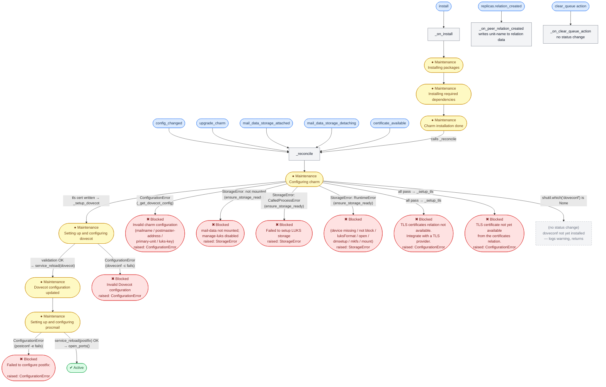

# Dovecot Charm State Diagrams

Based on `pr/3-tls`: storage + TLS + exception-based reconcile.

---

## Diagram 1 — Event → Handler → Unit Status

Shows which Juju events trigger which handlers, and every possible `unit.status` outcome.
Actions and `replicas.relation_created` produce no status changes.

---

## Diagram 2 — `_reconcile` Internal Call Chain

Full execution path inside `_reconcile`, showing both `try/except` blocks and every branch.

```mermaid
flowchart TD
    START(["_reconcile(event) called\nconfig_changed / upgrade_charm /\nmail_data_storage_attached /\nmail_data_storage_detaching /\ncertificate_available /\n[via _on_install]"])

    S1["unit.status =\nMaintenance('Configuring charm')"]

    %% ── try block 1: config + storage ───────────────────────────────────────
    TRY1[/"try"/]

    S2["_get_dovecot_config()\nDovecotConfig.from_charm()"]
    S2_RAISES["raises ConfigurationError\n'Invalid charm configuration…'\n(mailname / postmaster-address /\nprimary-unit / luks-key)"]

    S3["ensure_storage_ready(charm)\nstorage.py"]

    S3A{"manage_luks = False"}
    S3A_MT{"_mail_storage_mounted()\nos.path.ismount('/srv/mail')"}
    S3A_RAISE["raises StorageError\n'mail-data not mounted;\nmanage-luks disabled'"]
    S3A_OK["return (proceed)"]

    S3B{"manage_luks = True\nshutil.which('cryptsetup')"}
    S3B_NONE["None → log warning\nreturn (defer silently)"]

    S3C{"storages / dev_path\nvalid?"}
    S3C_BAD["empty or None\nlog error\nreturn (no block)"]

    S3D["setup_luks_storage(luks_key, dev_path)"]
    S3D_STEPS["① isLuks check\n② luksFormat if new (key via stdin)\n③ cryptsetup open if not mapped\n④ dmsetup mknodes\n⑤ blkid check for ext4\n⑥ mkfs.ext4 if no fs\n⑦ configure_file /etc/fstab\n⑧ mount → /srv/mail"]
    S3D_CPE["CalledProcessError\nraises StorageError\n'Failed to setup LUKS storage'"]
    S3D_RTE["RuntimeError\nraises StorageError(str(e))"]
    S3D_OK["return (LUKS ready)"]

    S3E["teardown_detaching_storage(charm)"]
    S3E_STEPS["if storages present → return (no-op)\nif storages gone:\n  manage_luks + mounted → umount\n  mapper exists → luksClose\nCalledProcessError → log only"]

    CATCH1["except CharmBlockedError as e\nunit.status = Blocked(str(e))\nreturn"]

    %% ── doveconf guard ───────────────────────────────────────────────────────
    S4{"shutil.which('doveconf')"}
    S4_NONE["log warning\n'Dovecot not installed yet'\nreturn\n(stays in Maintenance\n'Configuring charm')"]

    %% ── try block 2: tls + dovecot + procmail ───────────────────────────────
    TRY2[/"try"/]

    S5TLS["_setup_tls(dovecot_config)"]
    S5TLS_NO_REL["raises ConfigurationError\n'TLS certificates relation\nnot available…'"]
    S5TLS_NO_CERT["raises ConfigurationError\n'TLS certificate not yet\navailable…'"]
    S5TLS_OK["write cert → /etc/dovecot/private/<mailname>.pem (0o644)\nwrite key  → /etc/dovecot/private/<mailname>.key (0o600)"]

    S5A["_setup_dovecot(dovecot_config)"]
    S5A_1["unit.status =\nMaintenance('Setting up and\nconfiguring dovecot')"]
    S5A_2["render dovecot.conf.tmpl\n(ssl=required, mailname cert paths)\nwrite → /etc/dovecot/conf.d/\n99-local-dovecot-charm.conf"]
    S5A_3{"doveconf -c\n/etc/dovecot/conf.d/\n99-local-dovecot-charm.conf"}
    S5A_RAISE["raises ConfigurationError\n'Invalid Dovecot configuration,\ncheck logs for details'"]
    S5A_OK["service_reload('dovecot',\nrestart_on_failure=True)\nunit.status =\nMaintenance('Dovecot\nconfiguration updated')"]

    S5B["_setup_procmail()"]
    S5B_1["unit.status =\nMaintenance('Setting up and\nconfiguring procmail')"]
    S5B_2["mkdir /srv/mail (0o1777)\nrender procmailrc.tmpl\nwrite → /etc/procmailrc"]
    S5B_3{"postconf -e\nmailbox_command=procmail…"}
    S5B_RAISE["raises ConfigurationError\n'Failed to configure\npostfix: <stderr>'"]
    S5B_OK["service_reload('postfix',\nrestart_on_failure=True)"]

    CATCH2["except ConfigurationError as e\nunit.status = Blocked(str(e))\nreturn"]

    S5C["_open_ports()\ntcp: 143, 993, 110, 995, 4190, 9900"]
    ACTIVE(["unit.status = Active()"])

    %% ── Wiring ───────────────────────────────────────────────────────────────
    START --> S1 --> TRY1 --> S2
    S2 -->|"raises"| S2_RAISES
    S2 -->|"ok"| S3

    S3 --> S3A
    S3A -->|"True"| S3A_MT
    S3A_MT -->|"not mounted"| S3A_RAISE
    S3A_MT -->|"mounted"| S3A_OK

    S3A -->|"False (manage_luks=True)"| S3B
    S3B -->|"None"| S3B_NONE
    S3B -->|"found"| S3C
    S3C -->|"invalid"| S3C_BAD
    S3C -->|"valid"| S3D
    S3D --> S3D_STEPS
    S3D_STEPS -->|"CalledProcessError"| S3D_CPE
    S3D_STEPS -->|"RuntimeError"| S3D_RTE
    S3D_STEPS -->|"success"| S3D_OK

    S3A_OK & S3B_NONE & S3C_BAD & S3D_OK --> S3E
    S3E --> S3E_STEPS

    S2_RAISES & S3A_RAISE & S3D_CPE & S3D_RTE --> CATCH1

    S3E_STEPS --> S4
    S4 -->|"None"| S4_NONE
    S4 -->|"found"| TRY2

    TRY2 --> S5TLS
    S5TLS -->|"_tls is None"| S5TLS_NO_REL
    S5TLS -->|"get_assigned_certificate\nreturns (None,None)"| S5TLS_NO_CERT
    S5TLS -->|"cert+key obtained"| S5TLS_OK --> S5A
    S5A --> S5A_1 --> S5A_2 --> S5A_3
    S5A_3 -->|"non-zero exit"| S5A_RAISE
    S5A_3 -->|"exit 0"| S5A_OK --> S5B
    S5B --> S5B_1 --> S5B_2 --> S5B_3
    S5B_3 -->|"CalledProcessError"| S5B_RAISE
    S5B_3 -->|"success"| S5B_OK

    S5TLS_NO_REL & S5TLS_NO_CERT & S5A_RAISE & S5B_RAISE --> CATCH2

    S5B_OK --> S5C --> ACTIVE

    %% ── Styles ───────────────────────────────────────────────────────────────
    classDef tryblock fill:#ede9fe,stroke:#7c3aed,color:#3b0764
    classDef catch    fill:#fee2e2,stroke:#dc2626,color:#7f1d1d
    classDef decision fill:#e0f2fe,stroke:#0284c7,color:#0c4a6e
    classDef action   fill:#f3f4f6,stroke:#6b7280,color:#111827
    classDef maint    fill:#fef9c3,stroke:#ca8a04,color:#713f12
    classDef blocked  fill:#fee2e2,stroke:#dc2626,color:#7f1d1d
    classDef active   fill:#dcfce7,stroke:#16a34a,color:#14532d
    classDef silent   fill:#f3f4f6,stroke:#9ca3af,color:#6b7280,stroke-dasharray:4 4
    classDef start    fill:#dbeafe,stroke:#3b82f6,color:#1e3a5f
    classDef raises   fill:#fef3c7,stroke:#d97706,color:#78350f

    class START start
    class TRY1,TRY2 tryblock
    class CATCH1,CATCH2 catch
    class S3A,S3A_MT,S3B,S3C,S5A_3,S5B_3,S4,S5TLS decision
    class S2,S3,S3D,S3D_STEPS,S3E,S3E_STEPS,S5TLS_OK,S5A,S5A_1,S5A_2,S5A_OK,S5B,S5B_1,S5B_2,S5B_OK,S5C action
    class S5A_1,S5B_1 maint
    class S2_RAISES,S3A_RAISE,S3D_CPE,S3D_RTE,S5TLS_NO_REL,S5TLS_NO_CERT,S5A_RAISE,S5B_RAISE raises
    class ACTIVE active
    class S3B_NONE,S3C_BAD,S4_NONE silent
```

---

## Notes

- **`_on_install`** no longer guards on config — just installs packages then calls `_reconcile`. Config blocking handled entirely inside `_reconcile`.
- **`_configure` deleted** — inlined into `_reconcile` as second `try/except` block.
- **`certificate_available` wired to `_reconcile`** — same handler as all other events. No separate `_on_certificate_available`.
- **TLS is mandatory**: `ssl = required` always in dovecot.conf. The charm will not reach `ActiveStatus` without a working `certificates` relation that has issued a cert.
- **`_setup_tls`** runs first in the second try block — writes cert+key from relation data to `/etc/dovecot/private/` before dovecot config is rendered or validated.
- **Status written only in `_reconcile`** catch blocks (and transient Maintenance in individual setup methods). No function outside `_reconcile`/`_on_install` writes Blocked directly.
- **Exception hierarchy:** `StorageError` and `ConfigurationError` both extend `CharmBlockedError`. First `try/except` catches `CharmBlockedError` (both types). Second catches `ConfigurationError` only.
- **`teardown_detaching_storage`** never raises — `CalledProcessError` during umount/luksClose is logged and swallowed. Not in either try block.
- **Silent hang** remains: if `doveconf` absent, unit stays in `Maintenance("Configuring charm")` until next event.
- **No `WaitingStatus`** used anywhere.
- **LUKS key** fetched from Juju secret at config-validation time; passed to `cryptsetup` via stdin.
